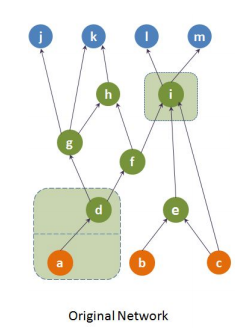
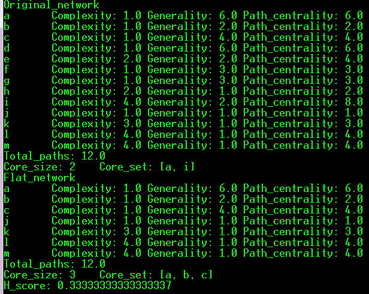
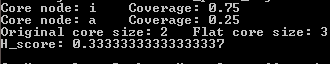

# Hourglass_effect_in_dependency_networks
> Many hierarchically modular systems are structured in a way that resembles an hourglass. This “hourglass effect” means that the system generates many outputs from many inputs through a relatively small number of intermediate modules that are critical for the operation of the entire system, referred to as the waist of the hourglass. We investigate the hourglass effect in general, not necessarily layered, hierarchical dependency networks. Our analysis focuses on the number of source-to-target dependency paths that traverse each vertex, and it identifies the core of a dependency network as the smallest set of vertices that collectively cover almost all dependency paths. We then examine if a given network exhibits the hourglass property or not, comparing its core size with a “flat” (i.e., non-hierarchical) network that preserves the source dependencies of each target in the original network. We have applied the proposed framework in a diverse set of dependency networks from technological, natural and information systems, showing that all these networks exhibit the general hourglass property but to a varying degree and with different waist characteristics.

>  **Keywords**:  _Modularity_, _Hierarchy_, _Centrality_, _Hourglass Networks_, _Dependency Networks_


* Last update: May-2019 
* Corresponding Paper: [The Hourglass Effect in Hierarchical Dependency Network](https://arxiv.org/pdf/1605.05025.pdf)
* [Network Science Journal](https://www.cambridge.org/core/journals/network-science/article/hourglass-effect-in-hierarchical-dependency-networks/DDBCA83D16CA74B827DAB66A98CC906A), September, 2017 
* [Author Homepage](http://sites.google.com/site/kmsabrin)

#### 0. Requirements

* Java 7 or greater

#### 1. How to Run

```
javac HourglassAnalysis.java
java HourglassAnalysis edge_list source_list target_list 0.9
```

#### 2. Input Format

A dependency network is assumed to be a directed, acyclic graph. We require the following graph information:

* edge_list: one edge per line in the following way, _from-node &lt;spaces&gt; to-node_
* source_list: one source node identifier per line
* target_list: one target node identifier per line
* coverage threshold: a number between 0 to 1

#### 3. Output Format

For each node in the original and flattened network, it prints out generality, complexity and path centrality.
It also prints out the total number of paths in the network, one sample core, core size and H-score.

#### 4. Sample Input-Output

Sample edge list, source list and target list is provided for the following network:




The output from the above run is following:




```diff
+ NEW
```
#### 5. Extension to Path Based Hourglass Analysis

Refer to the paper: [The hourglass organization of the C. elegans connectome](https://www.biorxiv.org/content/biorxiv/early/2019/04/07/600999.full.pdf)

To run:
```
javac HourglassAnalysisPathBased.java
java HourglassAnalysisPathBased pathFile 0.9
```

pathFile consists of source-target paths one per line, with node identifiers separated by whitespace.
A sample pathFile for the network depicted above is provided: "all_paths_toy.txt"

The ouput lists the core nodes for the given path coverage threshold (0.9 above), followed by the H-score.

The output from the above run is following:



#### 6. Generating paths

Refer to the paper: [The hourglass organization of the C. elegans connectome](https://www.biorxiv.org/content/biorxiv/early/2019/04/07/600999.full.pdf)

Given a dependency network, we want to generate paths that are at most k hops larger than the shortest paths between each pair of source-target nodes. So, we k=0, we get the all possible shortest paths between each pair of source-target nodes and if k=2, then for each pair of source-target nodes, we get all possible paths between them that are at most 2 hops larger than their shortest path hop distance. 

To run:
```
javac HourglassAnalysis.java
java HourglassAnalysis edge_list source_list target_list +k
```

edge_list, source_list and target_list is as described earlier. k can take any value >= 0. Note that the '+' is required in input. A output fill wil be created named 'paths.txt' containing all paths according to the specification above.

For the given sample network above if run the following,
```
java HourglassAnalysis edge_list.txt source_list.txt target_list.txt +2
```
the file 'paths.txt' will contain the following
```
a d g j 
a d f h k 
a d g h k 
a d g k 
a d f i l 
a d f i m 
b e i l 
b e i m 
c e i l 
c i l 
c e i m 
c i m 
```
